# Genshin Impact Quiz App ---
+ [Live Website](https://digimori.github.io/MilestoneProjectTwoGenshinQuiz/)
+ [Github Respository](https://github.com/digimori/MilestoneProjectTwoGenshinQuiz)

## Developer Goals:
---
This Genshin Impact quiz app is designed to be a short and sweet way of testing a players knowledge of the current in-game lore.   
There are a variety of questions, each one more increasingly difficult than the last.   
When the user clicks "Start Quiz", they will be shown a brief "How to play" box giving the rules and two buttons; One to exit the game and one to continue.  
Pressing the Exit Game button will take the user back to the "Start Quiz" page and the "New Game" button will take them to the quiz.  
When a user clicks an answer, they will be shown via a red or green overlay on if they are correct or not. They can then hit the "Next question" button to take them to the next question.   
 Once the end of the questions has been reached, the player will then be met with a results screen which displays how many they got correct and if they would like to try again via a "New Game?" button. 

 ## User Stories: 
 ---
 As a user I want: 
- To be able to answer questions relating to the topic at hand, this being Genshin Impact, and to be told which answer is correct or not clearly - also given the right one if incorrect is selected.  
- To be able to easily start a new game once the rules have been read, and then again at the end, should I wish to retry.
- Easily exit the quiz if want to after reading how to play. 
- To be able to navigate through the quiz simply by pressing a "Next Question" button or equivelent.

 ## Design Choices:
---
 ### Fonts:
 I chose a [Google Font](https://fonts.google.com/) called "Philosopher", as it was the closest that I could find that matched the current in-game font.
The fall-back font is 'Sans-Serif' as always.

### Colours: 
    
I chose these colours as they were in line with the main game character's colour scheme.

### Logo: 
  
I re-rendered the logo in Photoshop, as it originally blended in far too much with the background. Giving it an outline helped this.

 ## Wireframes:
 Wireframes were created in [FIGMA](https://www.figma.com/)   
- 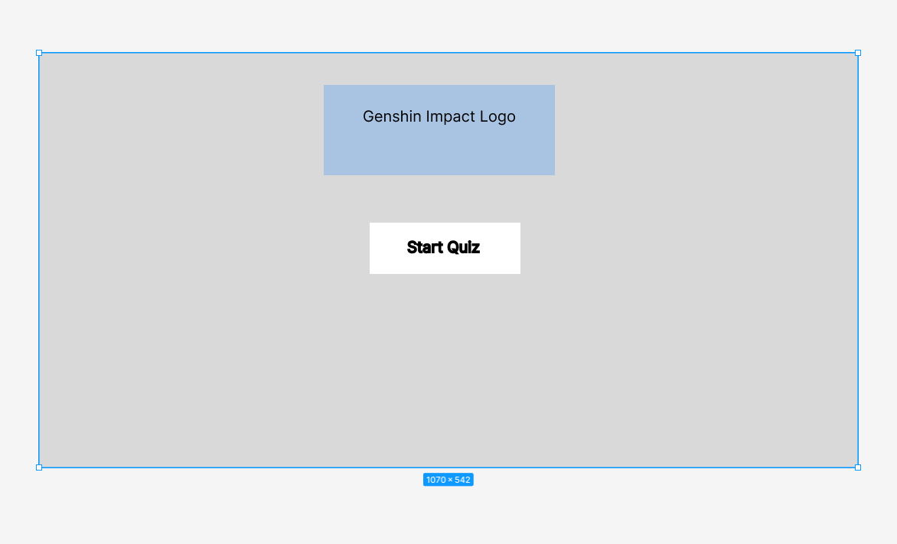
- 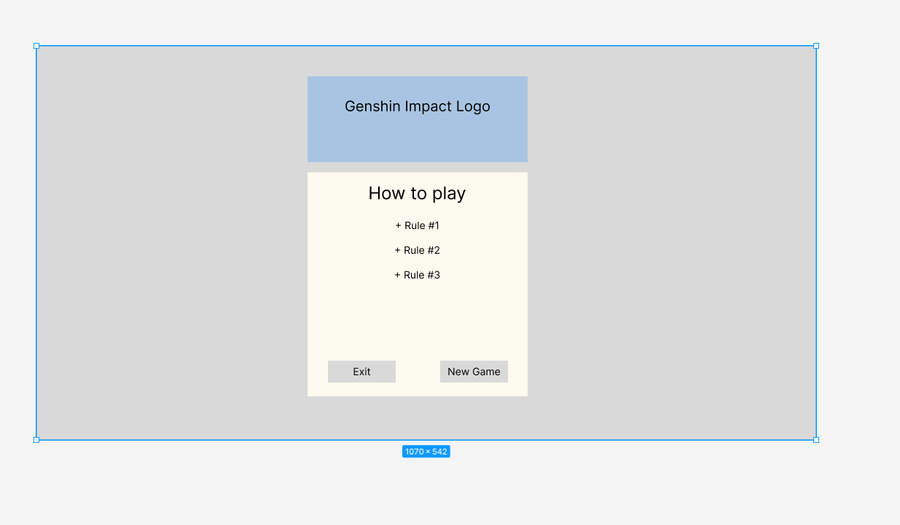
- 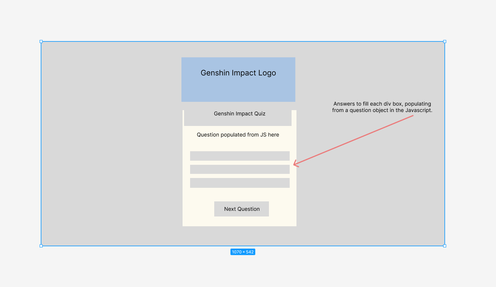
- 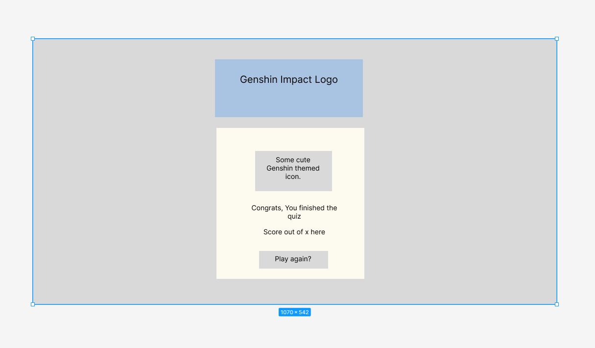

## Features:
---
### The Start Button:

The first element that a player will encounter upon loading the page is a 'Start Quiz' button. 
The background chosen is the in-game wish screen that every player is familiar with, beit happily or unhappily, depending on your luck. 
I would have liked to have found a better contrasting logo of the game, but it's either this or white, and neither unfortunately are particularly pretty. 

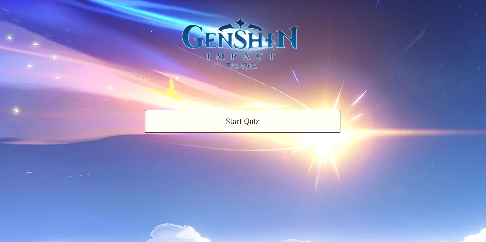

### How to Play Box:

Once the start button is clicked, the page will swap to a 'How to play' box, which contains information about the quiz.
On this same box, there are Exit Game and New Game buttons, both with their own functionality which will be explained below in the Navigation section.

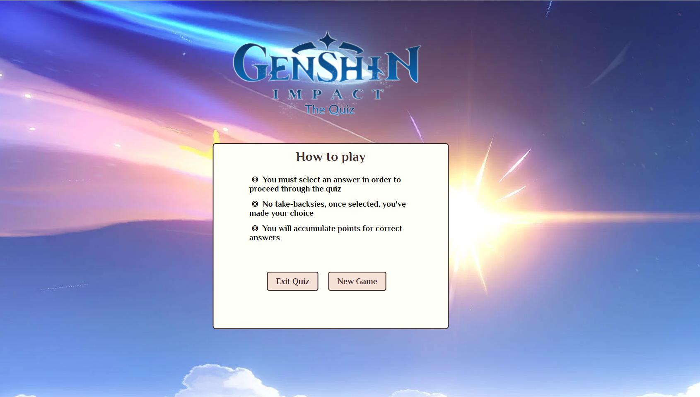

### The Quiz box:

The quiz box itself consists of a title, a section in where the questions are populated from the JavaScript text file, and the answers which are also populated in the same way.  
The answers are selectable, and once an answer has been selected, the others are disabled to disallow multiple selection.  
There is also a counter underneath the answers that tells the user how far they have progressed through the quiz by displaying an 'x of 21' questions.   
  
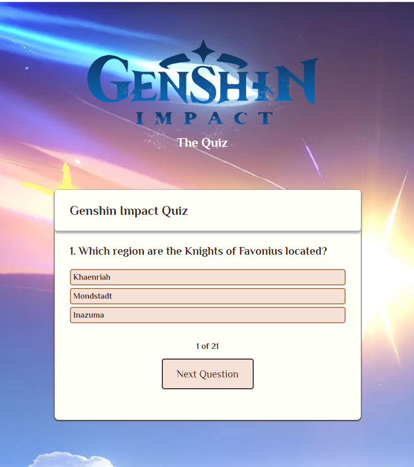  
  
There is a Next Question button at the bottom that then takes the user to the next question when they are ready.  
  
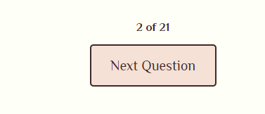  
  
### The Quiz Questions and Answers:
The questions, when clicked will change colour to signal a correct or incorrect answer; green for correct, red for incorrect.   
Once an answer is selected, the user cannot choose another one and must proceed to the next question.  
If the answer selected is incorrect, it will colour itself red and then also reveal the correct answer in green.  
  
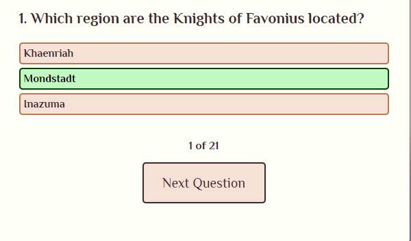  
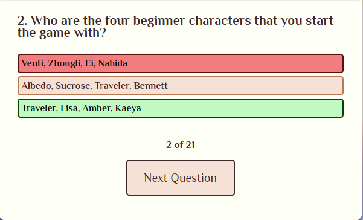  

### The Results page: 
The results page, I constructed to just be a basic "Congratulations" message and a part that tells you how much out of the total questions you scored correctly.   
Beneath this, I also give the user an option to try again with a "New Game?" button.

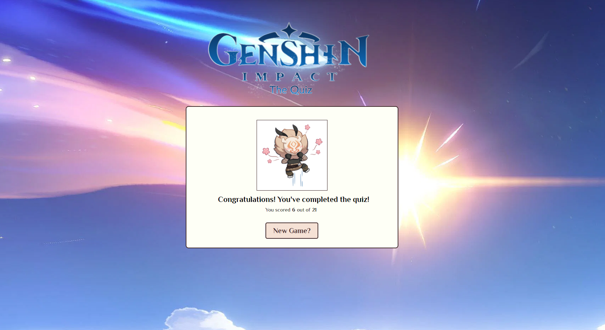

### Hilichurl ending image:   
This image is just an image file of the emojis that are found in the in-game chat.
I thought it appropriate, as it isn't biased towards any character in particular (It is just a basic enemy) and thought it was just cute, happy, celebratory image to finish the quiz with.  

## Navigation
---
The navigation is simple, consisting of a series of clearly labelled "Start Quiz", "Next Question", "New Game" "Exit Quiz" buttons.   

### How to Play Box - The buttons:
The "Start Quiz" button will open up the "How to Play" section, the "New Game" button within that section will start the quiz, and the "Exit Quiz" button will take the user back to the "Start Quiz" page.  I wanted to make the navigation simple, as the userbase for Genshin Impact consists of both adults and children alike.

### Next button:
The "Next Question" will take the user to the next question.   

### Results page buttons:
And finally, the "New Game?" button found on the Results page, will restart the quiz.  

## Testing and Validation:
---
### JSHint Metrics: 
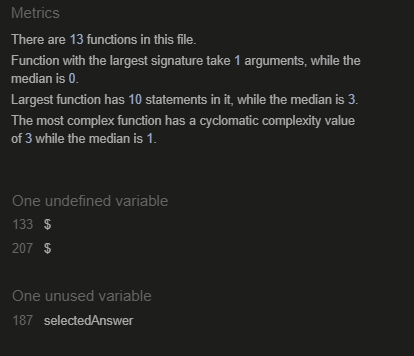  

There are three flags that I left in the code here and the reasons are:  
- The $ not recognised by JSHint is due to me using jQuery on certain lines of code.

- The "selectedAnswer" supposedly not being a variable. It's actually called in another function, linked back through the DOM. There is likely a better way to do this, but I found .setAttribute to be the only way that I could get it to function. 

So these are the only metrics that I endeavoured to not fix, as they are technically speaking, and confirmed with my mentor, not errors.

### HTML & CSS:
- All HTML has been validated at: [HTML Validation](https://validator.w3.org/nu/?doc=https%3A%2F%2Fdigimori.github.io%2FMilestoneProjectTwoGenshinQuiz%2F)      
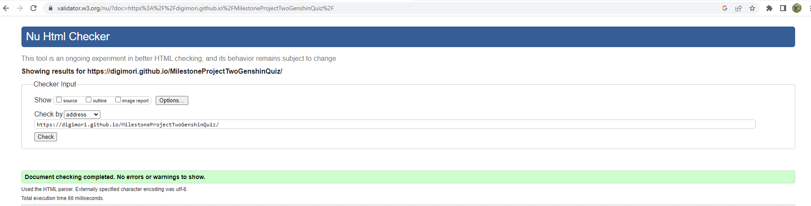    
  
- All CSS had been validated at: [CSS Validation](https://jigsaw.w3.org/css-validator/validator?uri=https%3A%2F%2Fdigimori.github.io%2FMilestoneProjectTwoGenshinQuiz%2F&profile=css3svg&usermedium=all&warning=1&vextwarning=&lang=en)  
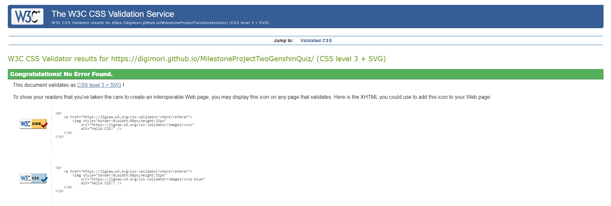

 ## Other tests:
 
 ### Manual Testing:
    
I used [AmIResponsive](https://ui.dev/amiresponsive?url=https://digimori.github.io/MilestoneProjectTwoGenshinQuiz/) to give a snapshot of everything working on varying screen sizes  

 ### Media Queries: 
#### Chrome DevTools:
 I used the Chrome Dev tools to implement changes in real time before performing a final commit on the code itself.  
 I did run into several issues with this whilst using Gitpod, as I was finding that it was not updating in real time, and so switched over to JSFiddle and VSCode for the remainder.

#### Manual Testing: 
- I went through the quiz manually at each point of development by launching it both into Github pages, and via Gitpod's preview feature.
- I also asked some friends who play the game and also have developer knowledge to go through it to help comb through any issues.

## Bugs: 
Fairly late into testing, I noticed that I accidentally had half of the answer keys in my "questions" object as "answer" and  the rest as "answers" which meant it wouldn't go past a certain amount of questions before throwing an error.  
This was easily fixed by just changing the "answers" key back to just "answer" on all of the objects.

## Deployment:
---
### Github: 

**To deploy and run locally via an IDE:**  
1. Use the Chrome browser
2. Create a Gitpod account at [this link](https://www.gitpod.io/)
3. Download and install the Gitpod browser extension for Google Chrome.
4. Restart browser after installation has completed.
5. Log into Gitpod using your Github username and password. (If you don't already have a GitHub account, create one [here](https://github.com/)
6. Navigate into your desired Gitpod repository (This project's repository can be found both at the top of this README, and [here](https://github.com/digimori/MilestoneProjectTwoGenshinQuiz)  
7. Click the green "Gitpod" button on the top right of the repository file section.

**This will open the project into a Gitpod workspace and can then be worked on in a local setting, such as VSCode.**

**Clone and Fork:**
1. Follow [This link](https://github.com/digimori/MilestoneProjectTwoGenshinQuiz) back to the Github project respository.
2. Select the menu item above the repository files labelled "Code".
3. To clone: Select the appropriate url or open to Git Desktop.
4. To view on a web IDE: Click the dropdown labelled "Open in Web IDE" on the top right of the repository, and choose the appropriate IDE.   
This dropdown can also be used to clone the code into VSCode IDE.
5. To clone into the Local IDE - in the terminal, type 'git clone' followed by the URL that can be copied from the aforementioned Code URL.
6. To fork - Follow the instructions as outlined in the Github Docs [here](https://docs.github.com/en/get-started/quickstart/fork-a-repo).

**To Deploy the respoitory to Github pages:**
1. Open the Github repository [here](https://github.com/digimori/MilestoneProjectTwoGenshinQuiz)
2. Click the 'Settings' tab above the repository.
3. In the side bar to the left, click on "Pages".
4. Under "Build and Deployment", select the "Deploy from branch" under the "Source" tab.
5. In the "Branch" drop-down below, select the '/main' branch and click save.
6. This should create an accessible page once it has refreshed.
7. Follow steps 1-3 again to find the deployed page, which will now be above the "Build and Deployment" section.

## Credits:
---

### Code: 
Coding Ninjas - [How to Create a Quiz in Javascript]("https://www.codingninjas.com/codestudio/library/how-to-create-a-quiz-app-using-javascript")    
I used this as a general idea to begin with, but there were a lot of aspects that I didn't like and changed them.   
I used it more as both inspiration and to refresh my memory on what I needed to consider when building.

### Images and media: 
- Hilichurl Logo for the results page was pulled from the in-game chat emojis.
- Genshin Impact logo itself was from [CityPNG](https://www.citypng.com/), and edited in Photoshop.
- The questions themselves are derived from the in-game lore, of which there is a lot of it.

### Other: 
- My awesome programmer friends for looking over my code and pointing out my dumb choices in parts during moments I was about ready to give up.
- StackOverflow for just existing to be honest.